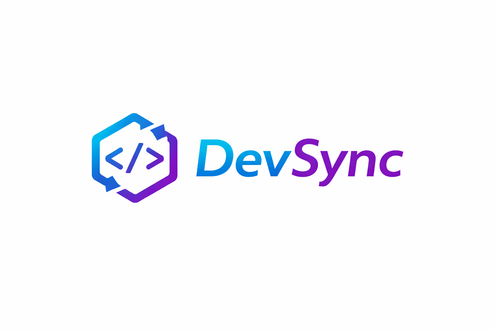

  

#ShadowDocs CLI

# shadowdocs-cli
Open-source documentetion site for shadowdocs CLI

ShadowDocs-CLI is an open-source command line tool designed to help users manage notes efficiently and quickly

---

## objectives
The main objectives of this project are:
-	To create a lightweight documentation management tool.
-	To allow users to generate structured documentation quickly.
-	To demonstrate the use of open source tools such as Git, Linux commands, and CLI based development.
-	To practice system development concepts learned in the IT231 course.

## Features
- create notes
- edit notes
- delete notes
- search notes
- list all notes

  ---
## usage
see USAGE.mg for command examples and usage guide

## Contributing 
We welcome contributions!
- please read CONTRIBUTION.md before submiting pull requests

  ---

## Lisence
This project is lisenced under the MIT lisence
## Authors
1. Joshua Malekela
2. Juvenal Tilya
3. Alex Audax
4. Sinimesi Sadock
